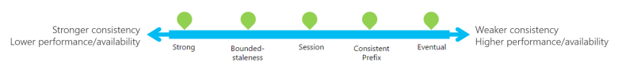

# Azure Cosmos DB

## Request Unit (RU)

Azure Cosmos DB measures throughput using something called a **request unit** (RU). Request unit usage is measured per second, so the unit of measure is request units per second (RU/s). We must reserve the number of RU/s we want Azure Cosmos DB to provision in advance, so it can handle the load we've estimated, and we can scale our RU/s up or down at any time to meet current demand. An RU is the amount of CPU, disk I/O, and memory required to read 1 KB of data in 1 second.

RUs are provisioned at database level and can also be provisioned at container level. Throughput on an Azure Cosmos database is shared across all the containers in the database unless explicitly defined at container level.

The RUs consumed depend on **item size** (the bigger, the more RUs needed), **item indexing** (fewer RUs are consumed if not all items in a container are indexed), **item property count**, **indexed properties** (the more indexed properties, the higher the RUs needed), **data consistency policy** (strong and bounded staleness consume two times more RUs on read operations) and **query complexity**.

If throughput limits are exceeded, request will be rate-limited.

The RUs provisioned on a Cosmos container (or database) are provisioned in all the regions associated with the accounted so if we have *R* RUs and *N* regions, the total will be *R * N*.

## APIs available

- **Core(SQL)** - stores data in document format. It offers the best end-to-end experience as we have full control over the interface, service, and the SDK client libraries. We can query the hierarchical JSON documents with a SQL-like language. Core (SQL) uses JavaScript's type system, expression evaluation, and function invocation.
- **MongoDB** - allows existing MongoDB client SDKs, drivers, and tools to interact with the data transparently, as if they are running against an actual MongoDB database. The data is stored in document format, which is the same as using Core (SQL).
- **Cassandra** - stores data in column-oriented schema. It's possible to query data by using the Cassandra Query Language (CQL), and data will appear to be a partitioned row store. Just like the MongoDB API, any clients or tools should be able to connect transparently to Azure Cosmos DB; only connection settings should need to be updated. 
- **Gremlin** -  allows users to make graph queries and stores data as edges and vertices. A graph-based view on the database means data is either a vertex (which is an individual item in the database), or an edge (which is a relationship between items in the database).
- **Table** - stores data in key/value format. Provides support for applications that are written for Azure Table Storage that need premium capabilities like global distribution, high availability, scalable throughput. The original Table API only allows for indexing on the Partition and Row keys; there are no secondary indexes. Storing table data in Cosmos DB automatically indexes all the properties, and requires no index management. Querying is accomplished by using OData and LINQ queries in code, and the original REST API for GET operations.

A Cosmos DB container is specialized into API-specific entities as shown in the following table:

| Azure Cosmos entity | SQL API | Cassandra API | Azure Cosmos DB API for MongoDB | Gremlin API | Table API |
| --- | --- | --- | --- | --- | --- |
|Azure Cosmos container | Container | Table | Collection | Graph | Table |

Cosmos DB items

| Cosmos entity | SQL API | Cassandra API | Azure Cosmos DB API for MongoDB | Gremlin API | Table API |
| --- | --- | --- | --- | --- | --- |
|Azure Cosmos item | Item | Row | Document | Node or edge | Item |
## Partition Strategy

Azure Cosmos DB uses partitioning to scale individual containers in a database to meet the performance needs. In partitioning, the items in a container are divided into distinct subsets called ***logical partitions***. Logical partitions are formed based on the value of a partition key that is associated with each item in a container. All the items in a logical partition have the same partition key value.

In addition to a partition key that determines the item's logical partition, each item in a container has an *item ID* (unique within a logical partition). Combining the partition key and the item ID creates the item's ***index***, which uniquely identifies the item.

A container is scaled by distributing data and throughput across ***physical partitions***. Internally, one or more logical partitions are mapped to a single physical partition. Typically smaller containers have many logical partitions but they only require a single physical partition. Unlike logical partitions, physical partitions are an internal implementation of the system and they are entirely managed by Azure Cosmos DB.

The number of physical partitions in a container depends on the number of throughput provisioned (each individual physical partition can provide a throughput of up to 10,000 request units per second) and the total data storage (each individual physical partition can store up to 50GB data).

Throughput provisioned for a container is divided evenly among physical partitions. A partition key design that doesn't distribute requests evenly might result in too many requests directed to a small subset of partitions that become "hot." Hot partitions lead to inefficient use of provisioned throughput, which might result in rate-limiting and higher costs.

Azure Cosmos DB transparently and automatically manages the placement of logical partitions on physical partitions to efficiently satisfy the scalability and performance needs of the container. As the throughput and storage requirements of an application increase, Azure Cosmos DB moves logical partitions to automatically spread the load across a greater number of physical partitions. It uses hash-based partitioning to spread logical partitions across physical partitions. 

A partition key defines the partition strategy, it's set when creating a container and can't be changed. 

**Best practices:**
- Be a property that has a value which does not change
- Partition key with a high cardinality
- Evenly distribute requests
- Evenly distribute storage

For most containers this should be enough. For large read-heavy containers, choosing a partition key that appears frequently as a filter in queries can make sense. Queries can then be efficiently routed to only the relevant physical partitions.

## Indexing modes

By default, all document properties in Azure Cosmos DB are indexed.

The three indexing modes you can use with Azure Cosmos DB are:

**Consistent**: The index is updated synchronously every time a new document is written to the collection. New queries on the collection use the updated index immediately. Query results are consistent with the updated documents in the collection.

**Lazy**: The index is updated at a lower priority. The reads and writes from the collection take a higher priority. In lazy mode, writes are cheaper because the index isn't updated immediately. When the index is fully updated depends on the demands on the collection. Query results don't include the updated documents until the index is consistent with the collection.

**None**: No index is created. Queries are expensive on collections that aren't indexed. If you're using your Azure Cosmos DB collection to read records directly rather than querying the collection, it's possible to avoid the overhead of indexing.

## Multi-master support

Multi-master support is an option that can be enabled on new Azure Cosmos DB accounts. Once the account is replicated in multiple regions, each region is a master region that equally participates in a write-anywhere model, also known as an active-active pattern.

Azure Cosmos DB regions operating as master regions in a multi-master configuration automatically work to converge data written to all replicas and ensure global consistency and data integrity.
## Conflict resolution

- **Last-Writer-Wins (LWW)**, in which conflicts are resolved based on the value of a user-defined integer property in the document. By default _ts is used to determine the last written document. Last-Writer-Wins is the default conflict handling mechanism.
- **Custom - User-defined function**, in which you can fully control conflict resolution by registering a User-defined function to the collection. A User-defined function is a special type of stored procedure with a specific signature. If the User-defined function fails or does not exist, Azure Cosmos DB will add all conflicts into the read-only conflicts feed they can be processed asynchronously.
- **Custom - Async**, in which Azure Cosmos DB excludes all conflicts from being committed and registers them in the read-only conflicts feed for deferred resolution by the user’s application. The application can perform conflict resolution asynchronously and use any logic or refer to any external source, application, or service to resolve the conflict.

## Consistency levels

  

| Consistency Level | Guarantees | Data Consistency | Latency | Throughput | Examples
| ----------------- | ---------- | ---------------- | ------- | ---------- | -------- |
Strong | Linearizability. Reads are guaranteed to return the most recent version of an item. Not possible in multiple write regions. | Highest | High | Lowest | Financial, inventory
Bounded Staleness | Consistent Prefix. Reads lag behind writes by at most k prefixes or t interval. It's consistent beyond a user-defined threshold, provides a guarantee for "how eventual" eventual is. | High | High | Low | Apps showing status, tracking, scores, etc
Session	| Consistent Prefix. Monotonic reads, monotonic writes, read-your-writes, write-follows-reads. Strong consistency for the session (all reads are current with writes from that session but writes from other sessions may lag), data from other sessions come in order, may just not be current | Moderate | Moderate | Moderate | Social apps, shopping cart
Consistent Prefix | Updates returned are some prefix of all the updates, with no gaps. Reads are consistent to a specific point in time, they are accurate but may not be current and there's no guarantee on how current values are| Low | Low | Moderate | Social media (comments, likes), apps with updates like scores
Eventual | Out of order reads. | Lowest | Low | Highest | Non-ordered updates like reviews and ratings.

## Random notes

Automatic failover can be configured and failover priority for regions can be changed.

Manual failover can be executed as well.

Change feed is a persistent record of changes to a container in the order they occur. The persisted changes can be processed asynchronously and incrementally, and the output can be distributed across one or more consumers for parallel processing. Change feed is enabled by default for all Azure Cosmos accounts.

