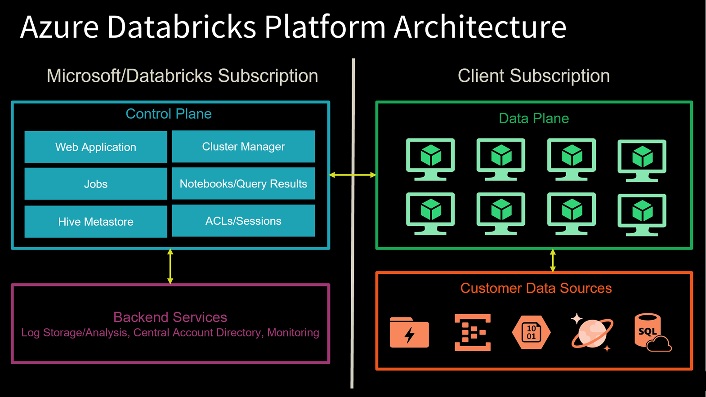
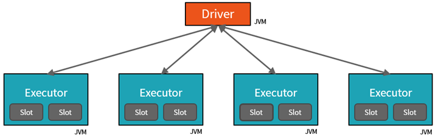

## Azure Databricks

Azure Databricks is a data analytics platform optimized for the Microsoft Azure cloud services platform. Azure Databricks offers three environments for developing data intensive applications: Databricks SQL, Databricks Data Science & Engineering, and Databricks Machine Learning.

**Databricks SQL** provides an easy-to-use platform for analysts who want to run SQL queries on their data lake, create multiple visualization types to explore query results from different perspectives, and build and share dashboards.

**Databricks Data Science & Engineering** provides an interactive workspace that enables collaboration between data engineers, data scientists, and machine learning engineers. For a big data pipeline, the data (raw or structured) is ingested into Azure through Azure Data Factory in batches, or streamed near real-time using Apache Kafka, Event Hub, or IoT Hub. This data lands in a data lake for long term persisted storage, in Azure Blob Storage or Azure Data Lake Storage. As part of your analytics workflow, use Azure Databricks to read data from multiple data sources and turn it into breakthrough insights using Spark.

**Databricks Machine Learning** is an integrated end-to-end machine learning environment incorporating managed services for experiment tracking, model training, feature development and management, and feature and model serving.

To address the problems seen on other Big Data platforms, Azure Databricks was optimized from the ground up, with a focus on performance and cost-efficiency in the cloud. Some of its key capabilities are:
- High-speed connectors to Azure storage services, such as Azure - Blob Store and Azure Data Lake
- Auto-scaling and auto-termination of Spark clusters to minimize costs
- Caching
- Indexing
- Advanced query optimization

### Azure Databricks Platform Architecture

  

The Contro Plane hosts Databricks jobs, notebooks with query results, the cluster manager, web application, Hive metastore, and security access control lists (ACLs) and user sessions. These components are managed by Microsoft in collaboration with Databricks and do not reside within our Azure subscription.

The Data Plane contains all the Databricks runtime clusters hosted within the workspace. All data processing and storage exists within the client subscription. This means no data processing ever takes place within the Microsoft/Databricks-managed subscription.

  

Since the web app and cluster manager is part of the Control Plane, any commands executed in a notebook are sent from the cluster manager to the customer's clusters in the Data Plane. This is because the data processing only occurs within the customer's own subscription. Any table metadata and logs are exchanged between these two high-level components. Customer data sources within the client subscription exchange data with the Data Plane through read and write activities.

  

 At the top of the diagram is the Control Plane that exists within the Microsoft subscription. The customer subscription is at the bottom of the diagram, which contains the Data Plane and data sources.

A Microsoft-managed Azure Databricks workspace virtual network (VNet) exists within the customer subscription. Information exchanged between this VNet and the Microsoft-managed Azure Databricks Control Plane VNet is sent over a secure TLS connection through ports (22 and 5557) that are enabled by Network Security Groups (NSGs) and protected with port IP filtering.

The Blob Storage account provides default file storage within the workspace (databricks file system (DBFS)). This resource and all other Microsoft-managed resources are completely locked from changes made by the customer. All other resources within the customer subscription are customer-managed and can be added or modified per your Azure subscription permissions. Connectivity between these resources and the Databricks clusters that reside within the Data Plane is secured via TLS.

We can write to the default DBFS file storage as needed, but we cannot change the Blob Storage account settings since the account is managed by the Microsoft-managed Control Plane. As a best practice, only use the default storage for temporary files and mount additional storage accounts (Blob Storage or Azure Data Lake Storage Gen2) that you create in your Azure subscription, for long-term file storage. 

If we need advanced network connectivity, such as custom VNet peering and VNet injection, we could deploy Azure Databricks Data Plane resources within our own VNet. 

### Key Concepts

**Workspace** - environment for accessing all of Azure Databricks assets. A workspace organizes objects (notebooks, libraries, dashboards, and experiments) into folders and provides access to data objects and computational resources.

**Notebook** - web-based interface to documents that contain runnable commands, visualizations, and narrative text.

**Dashboard** - interface that provides organized access to visualizations

**Library** - package of code available to the notebook or job running on the cluster. Databricks runtimes include many libraries and we can add our own.

**Experiment** - collection of MLflow runs for training a machine learning model.

**Databricks File System (DBFS)** - distributed file system mounted into an Azure Databricks workspace and available on Azure Databricks clusters. DBFS is an abstraction on top of scalable object storage allowing us to mount storage objects so that we can seamlessly access data without requiring credentials, interact with object storage using directory and file semantics instead of storage URLs and persist files to object storage, so they aren't lost after cluster termination.

**Database** - collection of tables. An Azure Databricks table is a collection of structured data. We can cache, filter, and perform any operations supported by Apache Spark DataFrames on Azure Databricks tables. We can query tables with Spark APIs and Spark SQL.

**Metastore** - The component that stores all the structure information of the various tables and partitions in the data warehouse including column and column type information, the serializers and deserializers necessary to read and write data, and the corresponding files where the data is stored. Every Azure Databricks deployment has a central Hive metastore accessible by all clusters to persist table metadata.

**Cluster** - set of computation resources and configurations on which we run data engineering, data science, and data analytics workloads, such as production ETL pipelines, streaming analytics, ad-hoc analytics, and machine learning.

**Pool** - A set of idle, ready-to-use instances that reduce cluster start and auto-scaling times. When attached to a pool, a cluster allocates its driver and worker nodes from the pool. If the pool does not have sufficient idle resources to accommodate the cluster’s request, the pool expands by allocating new instances from the instance provider

**Databricks runtime** -  set of core components that run on the clusters managed by Azure Databricks. Azure Databricks offers several types of runtimes

**Job** - A non-interactive mechanism for running a notebook or library either immediately or on a scheduled basis.

### Architecture of Azure Databricks spark cluster

Apache Spark clusters are groups of computers that are treated as a single computer and handle the execution of commands issued from notebooks. Using a master-worker type architecture, clusters allow processing of data to be parallelized across many computers to improve scale and performance. They consist of a Spark Driver (master) and worker nodes. The driver node sends work to the worker nodes and instructs them to pull data from a specified data source.

In Databricks, the notebook interface is the driver program. This driver program contains the main loop for the program and creates distributed datasets on the cluster, then applies operations (transformations & actions) to those datasets. Driver programs access Apache Spark through a SparkSession object regardless of deployment location.

Microsoft Azure manages the cluster, and auto-scales it as needed based on your usage and the setting used when configuring the cluster. Auto-termination can also be enabled, which allows Azure to terminate the cluster after a specified number of minutes of inactivity.

 When creating an Azure Databricks service, a "Databricks appliance" is deployed as an Azure resource in our subscription. The "Databricks appliance" is deployed into Azure as a managed resource group containing the Driver and Worker VMs, along with other required resources, including a virtual network, a security group, and a storage account. All metadata for the cluster, such as scheduled jobs, is stored in an Azure Database with geo-replication for fault tolerance.

 Internally, Azure Kubernetes Service (AKS) is used to run the Azure Databricks control-plane and data-planes via containers.

### Architecture of a Spark job

Spark is a Distributed computing environment. The unit of distribution is a Spark Cluster. Every Cluster has a Driver and one or more executors. Work submitted to the Cluster is split into as many independent Jobs as needed. This is how work is distributed across the Cluster's nodes. Jobs are further subdivided into tasks. The input to a job is partitioned into one or more partitions. These partitions are the unit of work for each slot. In between tasks, partitions may need to be re-organized and shared over the network.

  

- The **Driver** is the JVM in which our application runs.
- Scaling vertically is limited to a finite amount of RAM, Threads and CPU speeds. Scaling horizontally means we can simply add new "nodes" to the cluster almost endlessly.
- We parallelize at two levels:
    - The first level of parallelization is the **Executor** - a Java virtual machine running on a node, typically, one instance per node.
    - The second level of parallelization is the **Slot** - the number of which is determined by the number of cores and CPUs of each node.
- Each **Executor** has a number of **Slots** to which parallelized **Tasks** can be assigned to it by the Driver.
- The Driver must also decide how to partition the data so that it can be distributed for parallel processing. Consequently, the Driver is assigning a Partition of data to each task - in this way each Task knows which piece of data it is to process.
- Each parallelized action is referred to as a Job.
- The results of each Job (parallelized/distributed action) is returned to the Driver.
- Depending on the work required, multiple Jobs will be required.
- Each Job is broken down into Stages.

### Data Protection

- Encryption at-rest and in-transit
- Access control - ADLS Passthrough
- Access control - folders, notebooks, clusters, jobs and tables
- Secrets (Key Vault-backed secrets)

### Lazy evaluation

- Transformations are **lazy**
- Actions are **eager**

Laziness it's important since it doesn't force all data to be loaded, it's easier to parallelize operations (multiple transformations can be processed on a single data element, single thread, single machine) and optimizations can be applied prior to code compilation.

#### **Types of Transformations**

A transformation may be wide or narrow.

A wide transformation (distinct, groupBy, repartition...) requires sharing data across workers.

A narrow transformation (filter, drop, coalesce...) can be applied per partition/worker with no need to share or shuffle data to other workers.

#### **Catalyst Optimizer**

At the core of Spark SQL lies the Catalyst Optimizer which is a query optimizer that supports both rule-based and cost-based optimization.

When code is executed, Spark SQL uses Catalyst's general tree transformation framework in four phases: **(1)** analyzing a logical plan to resolve references, **(2)** logical plan optimization,** (3)** physical planning, and **(4)** code generation to compile parts of the query to Java bytecode. In the physical planning phase, Catalyst may generate multiple plans and compare them based on cost. All other phases are purely rule-based.

#### **Performance enhancements enabled by shuffle operations and Tungsten**

**Pipelining**

- Pipelining is the idea of executing as many operations as possible on a single partition of data.
- Once a single partition of data is read into RAM, Spark will combine as many narrow operations as it can into a single Task
- Wide operations force a shuffle, conclude a stage, and end a pipeline.

**Shuffles**

A shuffle operation is triggered when data needs to move between executors.

To carry out the shuffle operation Spark needs to:

- Convert the data to the UnsafeRow, commonly referred to as **Tungsten Binary Format**.
- Write that data to disk on the local node - at this point the slot is free for the next task.
- Send that data across the wire to another executor
- Copy the data back into RAM on the new executor

**UnsafeRow**

Sharing data from one worker to another can be a costly operation.

Spark has optimized this operation by using a format called Tungsten.

Tungsten prevents the need for expensive serialization and de-serialization of objects in order to get data from one JVM to another.

UnsafeRow is the in-memory storage format for Spark SQL, DataFrames & Datasets. Advantages include compactness and efficiency (Spark can operatate directly out of Tungsten).

### Delta Lake

Delta Lake is a file format that can help build a data lake comprised of one or many tables in Delta Lake format. Delta Lake integrates tightly with Apache Spark, and uses an open format that is based on Parquet. Because it is an open-source format, Delta Lake is also supported by other data platforms, including Azure Synapse Analytics.

It is an open-source storage layer that brings ACID transactions to Apache Spark and big data workloads.

We can read and write data that's stored in Delta Lake by using Apache Spark SQL batch and streaming APIs. It provides the following functionalities:

- **ACID Transactions**: Data lakes typically have multiple data pipelines reading and writing data concurrently, and data engineers have to go through a tedious process to ensure data integrity, due to the lack of transactions. Delta Lake brings ACID transactions to data lakes. It provides serializability, the strongest level of isolation level.
- **Scalable Metadata Handling**: In big data, even the metadata itself can be "big data". Delta Lake treats metadata just like data, leveraging Spark's distributed processing power to handle all its metadata. As a result, Delta Lake can handle petabyte-scale tables with billions of partitions and files at ease.
- **Time Travel (data versioning)**: Delta Lake provides snapshots of data enabling developers to access and revert to earlier versions of data for audits, rollbacks or to reproduce experiments.
- **Open Format**: All data in Delta Lake is stored in Apache Parquet format enabling Delta Lake to leverage the efficient compression and encoding schemes that are native to Parquet.
- **Unified Batch and Streaming Source and Sink**: A table in Delta Lake is both a batch table, as well as a streaming source and sink. Streaming data ingest, batch historic backfill, and interactive queries all just work out of the box.
**Schema Enforcement**: Delta Lake provides the ability to specify your schema and enforce it. This helps ensure that the data types are correct and required columns are present, preventing bad **data from causing data corruption.
- **Schema Evolution**:Big data is continuously changing. Delta Lake enables you to make changes to a table schema that can be applied automatically, without the need for cumbersome DDL.
- **100% Compatible with Apache Spark API**: Developers can use Delta Lake with their existing data pipelines with minimal change as it is fully compatible with Spark, the commonly used big data processing engine.

Some additional features and optimizations:

- **Optimize** - performs file compaction, small files are compacted together into new larger files up to 1GB. This helps dealing with the small file problem.
- **Data skipping** - performance optimization that aims at speeindg up queries that contain filters.
- **ZOrdering** - technique to colocate related information in the same set of files. Maps multidimensional data to one dimension while preserving locality of data points.
- **Vacuum** - allows the clean up of invalid files to save on storage costs. Invalid files are small files compacted into a larger file with the *Optimize* command.