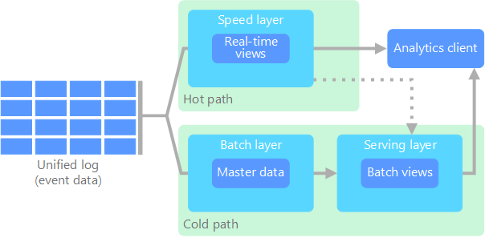
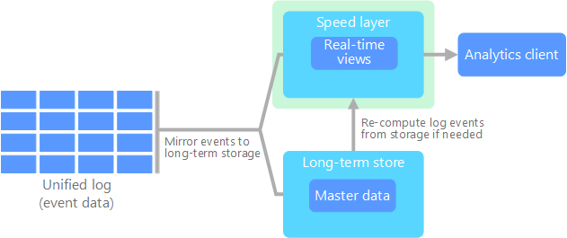

- Azure Cosmos DB provides both service-managed key & customer-managed keys for encryption of data.
  
- Currently storing and accessing geospatial data is supported by Cosmos DB SQL API accounts only.
  
- It's possible to configure automatic failover in Cosmos DB

- To optimize read requests costs in Cosmos DB we need to consider (from most efficient to least efficient): point reads (key/value lookup on a single item ID and partition key), query with a filter clause within a single partition key, query without an equality or range filter clause on any property, query without filters.

- When exporting a database, all data stored in encrypted columns is retrieved from the database in the encrypted form (ciphertext) and put into the resulting BACPAC. The resulting BACPAC also contains the metadata for Always Encrypted keys. When the BACPAC is imported into a database, the encrypted data from the BACPAC is loaded into the database and Always Encrypted key metadata is re-created.

- DR strategy for SQL Database Elastic Pools 
  - Databases deployed into 1 elastic pool in one Azure region and management databases deployed as geo-replicated single databases.
  - If an outage occurs in the primary region, the failover group initiates automatic failover of the management database to the DR region.
  - The elastic pool is created with the same configuration as the original pool
  - Geo-restore is used to create copies of tenant databases

- DMV **sys.dm_database_encryption_keys** returns information about the encryption state of a database and its associated database encryption keys.
- DMV **sys.dm_db_resource_stats** returns CPU, I/O and memory consumption of a SQL database
- DMV **sys.dm_exec_requests** returns information about each request that is executing in SQL Server.
- DMV **sys.dm_pdw_exec_requests** returns information about each request currently or recently active in Synapse Analytics
- DMV **sys.dm_db_partition_stats** returns page and row-count information for every partition in the current database

- When adding more databases (shards), in order to redistribute the data to the new databases without disrupting the data integrity, we need to use the **split-merge tool**. The split-merge tool runs as an Azure web service. Some requirements/limitations:
  - Shards need to exist and be registered in the shard map before a split-merge operation on these shards can be performed
  - Schema for all sharded tables and reference tables needs to exist on the target shard prior to any split operation
  - Service does not create tables or any other database objects automatically as part of its operations

- External tables created to be used by Polybase, can't be altered, need to be dropped and recreated

- To enable TDE we need: 1 - create a master key; 2 - create or obtain a certificate protected by the master key; 3 - create a database encryption key and protect it using the certificate; 4 - set the database to use encryption

- Azure Databricks High Concurrency Clusters provide fault isolation by creating an environment for each notebook, isolating them from one another.

- In Azure Streaming Analytics, the **watermark delay** metric can be used to understand if there aren#t enough processing resources to handle the volume of input events.

- In a Hadoop Distributed File System architecture, we have a single **NameNode**, a master server that manages the file system namespace and regulates access to files by clients. There are also a number of **DataNodes**, usually one per node in the cluster, which manage storage attached to the nodes that they run on.

- **Data Sync** uses a hub and spoke topology to synchronize data. The Hub must be an Azure SQL Database, the member databases can be either Azure SQL or instances of SQL Server and the Sync Metadata Database contains the metadata and log for Data Sync.

- **ADF** - When using PolyBase or COPY statement to load data into Azure Synapse Analytics, if source or staging Data Lake Storage Gen2 is configured with an Azure Virtual Network endpoint, we must use managed identity authentication as required by Synapse.

- For graph API in Cosmos DB, social networks/customer 365, IoT and recommendation engines are a good example where it can be useful.

- Active geo-replication is not supported by Azure SQL Databases Managed Instances

- VM Disk Types: Standard HDD (up to 2 000 IOPS), Standard SSD (up to 6 000 IOPS), Premium SSD (up to 20 000 IOPS), Ultra Disk (up to 160 000IOPS)

- 30 days after a cluster is terminated, it is permanently deleted. To keep an all-purpose cluster configuration even after a cluster has been terminated for more than 30 days, an administrator can pin the cluster. Up to 70 clusters can be pinned.

- SQL DB: Premium and Business Critical service tiers leverage the Premium availability model, which integrates compute resources (sqlservr.exe process) and storage (locally attached SSD) on a single node. High availability is achieved by replicating both compute and storage to additional nodes creating a three to four-node cluster.

- Both SQL Database and SQL Managed Instance use SQL Server technology to create full backups every week, differential backups every 12-24 hours, and transaction log backups every 5 to 10 minutes. 

- Geospatial functions in Azure Stream Analytics enable real-time analytics on streaming geospatial data. 

- To minimize data movement, in Synapse, a distribution column should be used in *JOIN, GROUP BY, DISTINCT, OVER* and *HAVING* clauses and not used in *WHERE* clauses besides not being a date column.

Azure Cosmos DB provides three ways to control access to data.

| Access control type | Characteristics |
|---|---|
| Primary keys | Shared secret allowing any management or data operation. It comes in both read-write and read-only variants. |
| Role-based access control | Fine-grained, role-based permission model using Azure Active Directory (AAD) identities for authentication. |
| Resource tokens | Fine-grained permission model based on native Azure Cosmos DB users and permissions. |

**Lambda architecture**

  

All data coming into the system goes through these two paths:

 - A **batch layer** (cold path) stores all of the incoming data in its raw form and performs batch processing on the data. The result of this processing is stored as a batch view.

- A **speed layer** (hot path) analyzes data in real time. This layer is designed for low latency, at the expense of accuracy.

The batch layer feeds into a **serving layer** that indexes the batch view for efficient querying. The speed layer updates the serving layer with incremental updates based on the most recent data

The raw data stored at the batch layer is immutable. Incoming data is always appended to the existing data, and the previous data is never overwritten. Any changes to the value of a particular datum are stored as a new timestamped event record. This allows for recomputation at any point in time across the history of the data collected. The ability to recompute the batch view from the original raw data is important, because it allows for new views to be created as the system evolves.

**Kappa Architecture** 

  

A drawback to the lambda architecture is its complexity. Processing logic appears in two different places — the cold and hot paths — using different frameworks. This leads to duplicate computation logic and the complexity of managing the architecture for both paths.

The kappa architecture was proposed by Jay Kreps as an alternative to the lambda architecture. It has the same basic goals as the lambda architecture, but with an important distinction: All data flows through a single path, using a stream processing system.

There are some similarities to the lambda architecture's batch layer, in that the event data is immutable and all of it is collected, instead of a subset. The data is ingested as a stream of events into a distributed and fault tolerant unified log. These events are ordered, and the current state of an event is changed only by a new event being appended. Similar to a lambda architecture's speed layer, all event processing is performed on the input stream and persisted as a real-time view.

