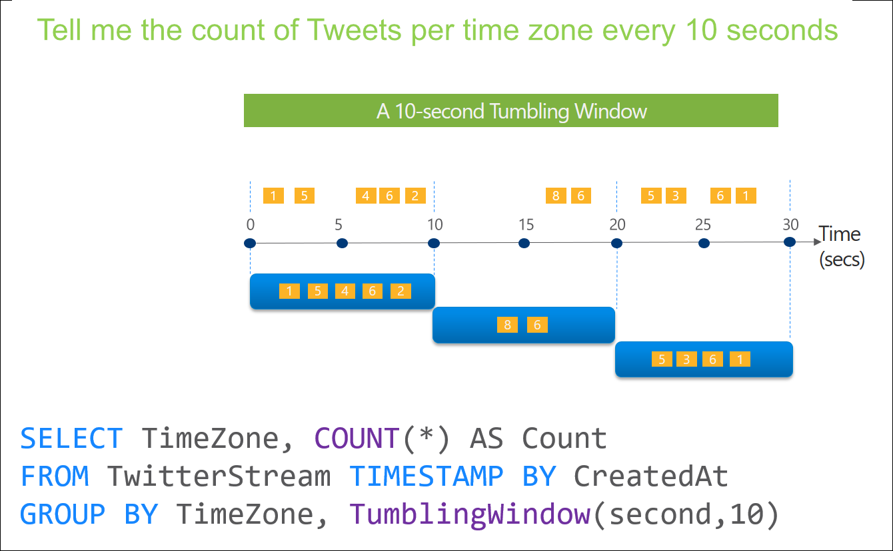
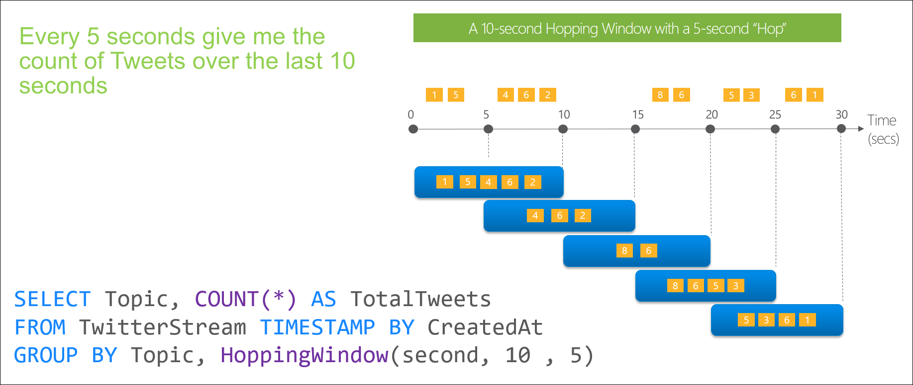
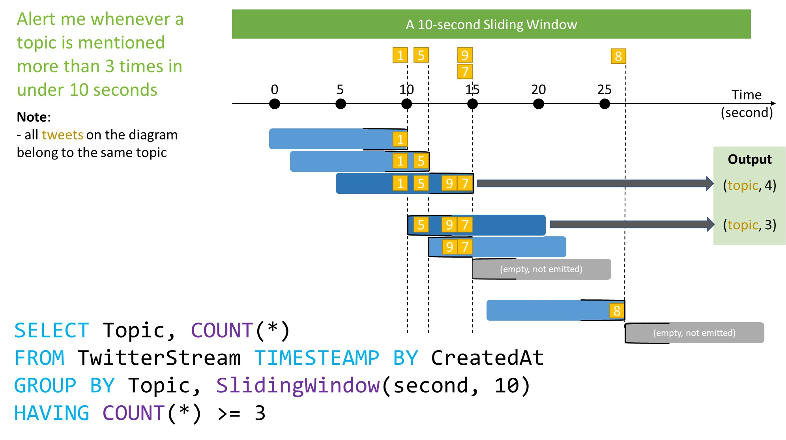
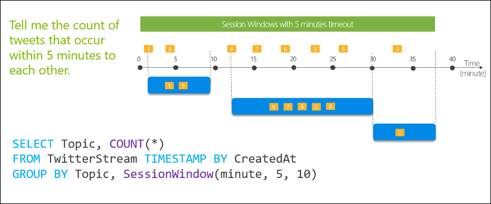

# Streaming

In the context of analytics, data streams are the data pertaining to the occurrence of specific activities that are emitted by applications, IoT devices or sensors, or other sources known as data producers. These perpetually generated data streams typically contain temporal and additional information about the events.

Data streams are most often used to better understand change over time. For example, an organization may perform sentiment analysis on tweets to see if an advertising campaign results in more positive comments about the company or its products.

## Approaches to data stream processing

There are two approaches to processing data streams: live and on-demand.

The most commonly adopted method for processing data streams is to analyze new data continuously as it arrives from an event producer, such as Azure Event Hubs. This "live" approach requires more processing power to run computations but offers the ability to gain near-real-time insights. 

The "on-demand" approach for processing streaming data involves persisting all incoming data in a data store, such as Azure Data Lake Storage (ADLS) Gen2. This method allows the collection of streaming data over time and store it as static data. It can then be processed in batches when convenient or during times when compute costs are lower.

## Event processing

Event processing refers to the consumption and analysis of a continuous data stream to extract latent knowledge and derive actionable insights from the events happening within that stream. Event processing pipelines provide an end-to-end solution for ingesting, transforming, and analyzing data streams and are made up of three distinct components:

- **Event producer** - application, connected device or sensor, or any other service that continuously outputs a data stream of events. Events can be any recurring action, such as a heartbeat, a car passing through a toll booth, or an engine sensor reporting temperature values on an automobile.
- **Event processor** - engine designed to consume and transform event data streams. Event processors require the ability to query time segments easily. Performing time-boxed computations or aggregations, such as counting the number of times an event happens during a particular period, is a frequent use case. 
- **Event consumer** -  application that consumes the output of an event processor. Event consumers can be used to visualize data or take a specific action based on the insights, such as generating alerts when specified thresholds are met or sending data to another event processing engine.

Event processing pipelines generally chain together multiple services to create a near-real-time analytics pipeline. 

## Azure Streaming Analytics

Azure Stream Analytics is a platform-as-a-service (PaaS) event processing engine. It enables the transformation and analysis of large volumes of streaming data arriving from Azure Event Hubs and IoT Hub and static data from Azure storage. 

An Azure Stream Analytics job consists of an input, query, and an output. Stream Analytics ingests data from Azure Event Hubs (including Azure Event Hubs from Apache Kafka), Azure IoT Hub, or Azure Blob Storage. The query, which is based on SQL query language, can be used to easily filter, sort, aggregate, and join streaming data over a period of time. This SQL language can also be extended with JavaScript and C# user-defined functions (UDFs). It can easily adjust the event ordering options and duration of time windows when performing aggregation operations through simple language constructs and/or configurations

Stream Analytics guarantees *exactly once* event processing and *at-least-once* event delivery, so events are never l
ost. It has built-in recovery capabilities in case the delivery of an event fails. Also, Stream Analytics provides built-in checkpointing to maintain the state of your job and produces repeatable results.

Streaming Units (SUs) represents the computing resources that are allocated to execute a Stream Analytics job.

Azure Stream Analytics includes native support for five kinds of temporal windowing functions (Tumbling, Hopping, Sliding, Session, Snapshot):

- **Tumbling Window** - segment a data stream into distinct time segments and perform a function against them. The key differentiators of a Tumbling window are that they repeat, do not overlap, and an event cannot belong to more than one tumbling window.

- **Hopping Window** - hop forward in time by a fixed period. It may be easy to think of them as Tumbling windows that can overlap and be emitted more often than the window size. Events can belong to more than one Hopping window result set. 

  

- **Sliding Window** - output events only for points in time when the content of the window acctually changes (an event enters or exits the window). Every window has, at least, one event.

  

- **Session Window** - group events that arrive at similar times, filtering out periods of time where there is no data. A session window begins when the first event occurs. If another event occurs within the specified timeout from the last ingested event, then the window extends to include the new event. Otherwise if no events occur within the timeout, then the window is closed at the timeout. If events keep occurring within the specified timeout, the session window will keep extending until maximum duration is reached. Since maximum duration chekcing intervals are set to be the same size as the specified max duration (if 10 - 10,20,30,40...), the actual duration of a session window could be up to twice maxDuration.

  

- **Snapshot Window** - grups events that have the same timestamp. DOesn't require a specific window function, can just use System.Timestamp() in the GROUP BY clause.

## Job Reliability

Stream Analytics guarantees jobs in paired regions are updated in separate batches. As a result there is a sufficient time gap between the updates to identify potential issues and remediate them.

It is recommended to deploy identical jobs to both paired regions. We should then monitor these jobs to get notified when something unexpected happens. 

## Azure Event Hub

Azure Event Hubs is a cloud-based, event-processing service that can receive and process millions of events per second. Event Hubs acts as a front door for an event pipeline, to receive incoming data and stores this data until processing resources are available.

An entity that sends data to the Event Hubs is called a publisher, and an entity that reads data from the Event Hubs is called a consumer or a subscriber. Azure Event Hubs sits between these two entities to divide the production (from the publisher) and consumption (to a subscriber) of an event stream. This decoupling helps to manage scenarios where the rate of event production is much higher than the consumption. 

An event is a small packet of information (a datagram) that contains a notification. Events can be published individually, or in batches, but a single publication (individual or batch) can't exceed 1 MB.

Event publishers are any app or device that can send out events using either HTTPS or Advanced Message Queuing Protocol (AMQP) 1.0.

For publishers that send data frequently, AMQP has better performance. However, it has a higher initial session overhead, because a persistent bidirectional socket and transport-level security (TLS) or SSL/TLS has to be set up first.

For more intermittent publishing, HTTPS is the better option. Though HTTPS requires additional overhead for each request, there isn't the session initialization overhead.

An Event Hub **consumer group** represents a specific view of an Event Hub data stream. By using separate consumer groups, multiple subscriber apps can process an event stream independently, and without affecting other apps. 